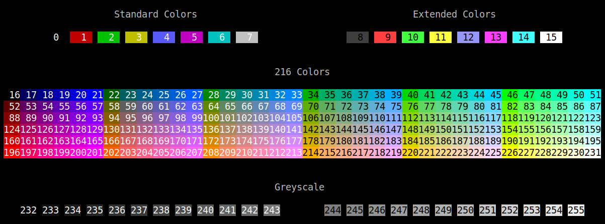

# print-console-colors

[](http://travis-ci.org/cdepillabout/print-console-colors)
[](https://hackage.haskell.org/package/print-console-colors)
[](http://stackage.org/lts/package/print-console-colors)
[](http://stackage.org/nightly/package/print-console-colors)
[](./LICENSE)

Print all the ANSI console colors for your terminal.

[](./img/example.png)

This program is useful when trying to set your terminal emulator colors, for
instance, when configuring [Termonad](https://github.com/cdepillabout/termonad).

## Installation

`print-console-colors` is available on
[Hackage](http://hackage.haskell.org/package/print-console-colors).  You can
install it with [`stack`](https://docs.haskellstack.org/en/stable/README/),
[`cabal`](https://www.haskell.org/cabal/), or [`nix`](https://nixos.org/nix/).

-   **Stack**:

    ```console
    $ stack install print-console-colors
    ```

-   **Cabal**:

    ```console
    $ cabal install print-console-colors
    ```

-   **Nix**:

    ```
    $ nix-env -f '<nixpkgs>' -iA haskellPackages.print-console-colors
    ```

## Usage

After installing it, just run the `print-console-colors` command!
